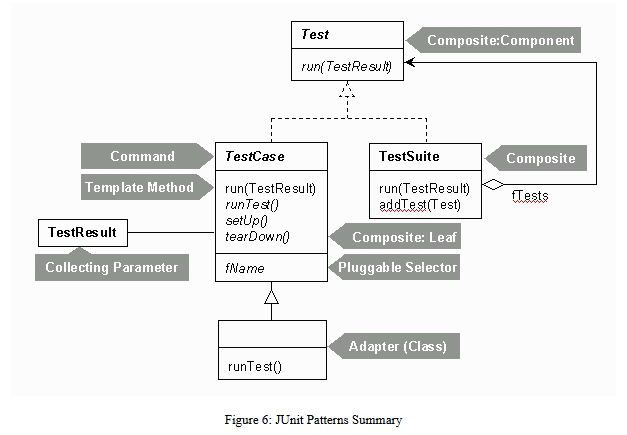
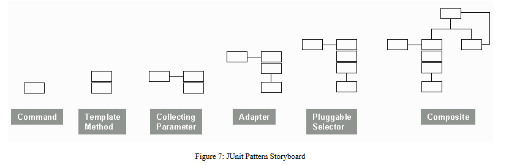

# RobustTest

## RobustTest is a Java testing framework based on JUnit A Cook's Tour.

## you can see the JUnit Patterns Summary and JUnit Pattern Storyboard in the following picture:

## Reference
[JUnit A Cook's Tour](https://www.cs.cmu.edu/~pattis/15-1XX/common/zips/junit4.1/doc/cookstour/cookstour.htm)
